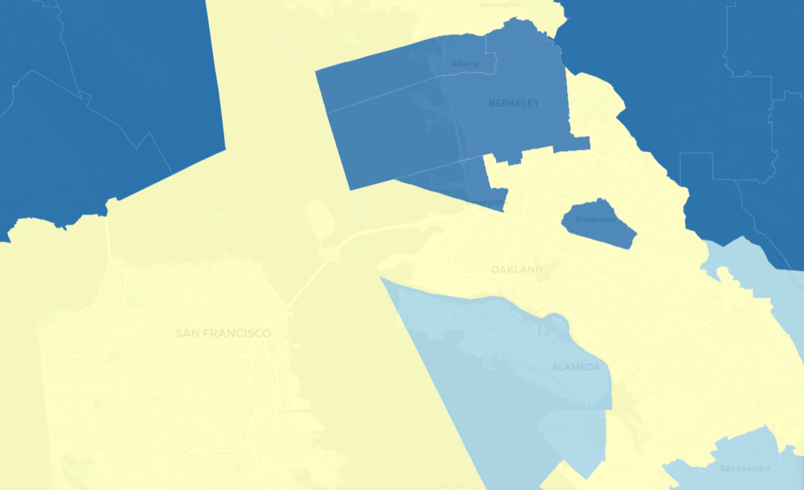

 

 

### California school districts serve diverse students and diverse families.

 
 
This project uses US Census American Community Survey data from 2018 to estimate the number of California students living in multigenerational, one parent, and extended-family households. Click on the tabs to view school district level maps for each type of household.

 

